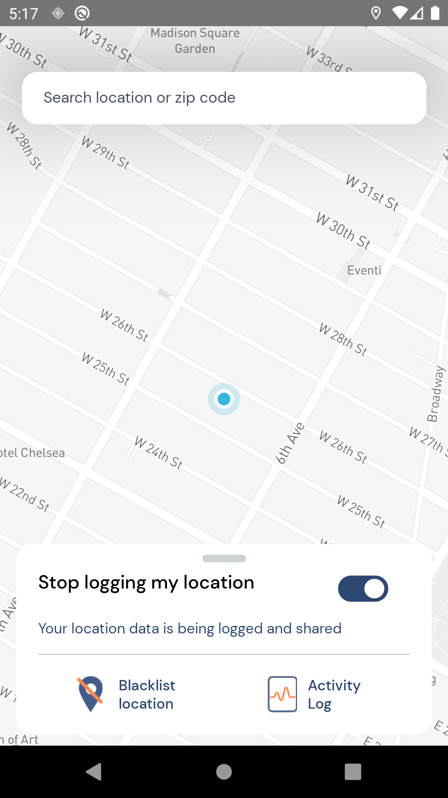

# Spaced

Based on MIT - [COVID-19 Safe Paths](http://safepaths.mit.edu/)

Intro: https://bit.ly/spaced-intro
Demo: https://bit.ly/spaced-demo

----



Spaced is a mobile app for empowering people to stop the spread of COVID-19 by being able to see how populated public spaces are in order to safely meet basic needs that require travel.

**Home page:** https://getspaced.io

# Development Overview

This is a React Native app version 61.5

## Architecture

Please refer to `docs/Private Kit Diagram.png` for a basic overview on the sequencing of generalized events and services that are utilized by Private Kit.

## Developer Setup

Refer to and run the dev_setup.sh (Linux/MacOS) or dev_setup.bat (Windows) for needed tools.

### iOS Configuration - First Time Setup

1. Move to `ios` directory and run `pod install`
2. If you have any trouble with packages not round, try `react-native link` from project directory.
3. Look at running commands below.

### MapBox API Key
You will need to generate a Mapbox key in order for the mapping features to work correctly. Visit mapbox [mapbox](https://www.mapbox.com/) in order to create the API key.

Once you have the API key, you will need to create a .env file that looks like the following:
```
MAPBOX_ACCESS_TOKEN={ACCESS_TOKEN_HERE}
```

## Running

Install modules:
```npm install``` or ```yarn install``` (note ```yarn``` does a better job at installing dependencies on macOS)

To run, do:
```
npx react-native run-android
```
or
```
npx react-native run-ios --simulator="iPhone 8 Plus"
```

NOTE: In some cases, the abovementioned procedure leads to the error 'Failed to load bundle - Could not connect to development server'. In these cases, kill all other react-native processes and try it again.

## Contributing

Read the [contribution guidelines](CONTRIBUTING.md).


